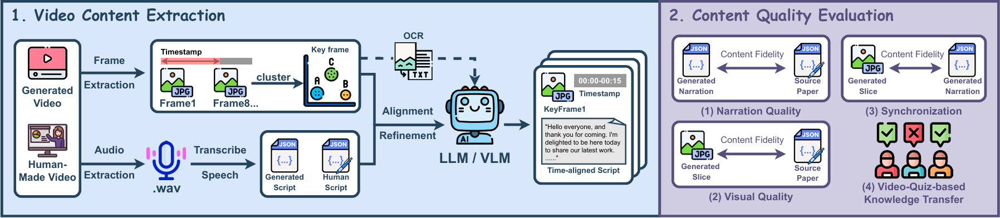

# 🎬 SciVidEval: Scientific Video Evaluation Toolkit

<p align="center">
  
  
  
  
</p>

**SciVidEval** is a comprehensive evaluation toolkit for assessing the quality of AI-generated scientific videos and narrations. It provides multiple evaluation metrics including text fidelity, slide quality, and temporal synchronization.



## ✨ Key Features

- 📊 **Text Fidelity Evaluation**: Measures narration quality using perplexity, ROUGE-L, and LLM-based consistency scoring
- 🖼️ **Slide Quality Assessment**: Evaluates visual content quality and information density
- ⏱️ **Temporal Synchronization**: Analyzes alignment between narration and visual content
- 🔊 **Audio Processing**: Automatic speech recognition (ASR) and audio extraction
- 🖥️ **Frame Analysis**: Video frame extraction, clustering, and OCR text extraction
- 🤖 **Multi-Modal Integration**: Supports GPT-4V, OCR, and various LLM models

## 📋 Table of Contents

- [🛠️ Installation](#installation)
- [🚀 Quick Start](#quick-start)
- [📊 Evaluation Metrics](#evaluation-metrics)
- [🔧 Tools Overview](#tools-overview)
- [📁 Project Structure](#project-structure)
- [⚙️ Configuration](#configuration)
- [📖 Usage Examples](#usage-examples)

---

## 🛠️ Installation

### Prerequisites

- Python 3.8+
- CUDA-compatible GPU (recommended for faster processing)
- FFmpeg for video processing

### Python Dependencies

```bash
cd SciVidEval
pip install -r requirements.txt
```

### Additional Dependencies

**FFmpeg for Video Processing:**
```bash
sudo apt install ffmpeg
```

**Chinese OCR Support:**
```bash
# PaddleOCR models will be downloaded automatically
# Ensure sufficient disk space for model files
```

## 🚀 Quick Start

### 1. Video Processing Pipeline

Process a scientific video to extract multimodal content:

```bash
python generate_video_summary.py \
    --video_path "/path/to/your/video.mp4" \
    --output_dir "./output" \
    --interval 2
```

### 2. Text Fidelity Evaluation

Evaluate narration quality against multiple baselines:

```bash
python tools/01_text_fidelity.py
```

### 3. Slide Quality Assessment

Analyze visual content quality:

```bash
python tools/02_slid_quality_thread.py
```

### 4. Synchronization Analysis

Evaluate temporal alignment:

```bash
python tools/03_synchronization.py
```

### 5. Batch Processing

Run complete evaluation pipeline:

```bash
bash run_processing.sh
```

## 📊 Evaluation Metrics

### Text Fidelity Metrics

- **Perplexity (PPL)**: Measures text naturalness using GPT-2 Large model
- **ROUGE-L**: Evaluates content overlap with source paper
- **LLM Consistency**: Semantic alignment assessed by GPT-4

### Slide Quality Metrics

- **Information Density**: Amount of meaningful content per slide
- **Visual Clarity**: OCR accuracy and text readability
- **Content Coherence**: Logical flow between slides

### Synchronization Metrics

- **Audio-Visual Alignment**: Temporal consistency between narration and slides
- **Content Timing**: Appropriate pacing and transitions
- **Segmentation Quality**: Natural break points and scene changes

## 🔧 Tools Overview

### Core Tools

| Tool | Description | Input | Output |
|------|-------------|-------|--------|
| `generate_video_summary.py` | Main pipeline for video processing | Video file | JSON summaries, frames, audio |
| `01_text_fidelity.py` | Text quality evaluation | Narration text | Fidelity scores |
| `02_slid_quality_thread.py` | Slide content assessment | Video frames | Quality metrics |
| `03_synchronization.py` | Temporal alignment analysis | Video + transcripts | Sync scores |
| `02_get_ppt_frames.py` | PPT frame extraction | PPT files | Frame images |
| `03_vtt2json.py` | Subtitle format conversion | VTT files | JSON format |

### Utility Modules

| Module | Purpose |
|--------|---------|
| `utils/asr_extract_audio.py` | Audio extraction and speech recognition |
| `utils/frame_cluster.py` | Video frame clustering and deduplication |
| `utils/gpt_ocr.py` | OCR text extraction |
| `utils/gpt_rewrite.py` | Text processing and merging |
| `utils/ocr_extract_ppt.py` | PPT text extraction |

## 📁 Project Structure

```
SciVidEval/
├── generate_video_summary.py    # Main video processing pipeline
├── requirements.txt             # Python dependencies
├── run_processing.sh           # Batch processing script
├── tools/                      # Evaluation tools
│   ├── 01_text_fidelity.py    # Text quality metrics
│   ├── 02_slid_quality_thread.py  # Slide quality assessment
│   ├── 03_synchronization.py  # Temporal sync analysis
│   ├── 02_get_ppt_frames.py   # PPT frame extraction
│   └── 03_vtt2json.py         # Subtitle conversion
├── utils/                      # Utility modules
│   ├── asr_extract_audio.py   # Audio processing
│   ├── frame_cluster.py       # Frame analysis
│   ├── gpt_ocr.py             # OCR extraction
│   ├── gpt_rewrite.py         # Text processing
│   └── ocr_extract_ppt.py     # PPT processing
├── results/                    # Evaluation results
│   ├── narration_quality_GPT-4o.json
│   ├── narration_quality_Gemini.json
│   ├── narration_quality_Human.json
│   └── ...
├── BAAI/                       # Model files
├── gpt2-large/                 # GPT-2 model for perplexity
└── *.json                      # Configuration and results
```

## ⚙️ Configuration

### Model Configurations

Edit the baseline configurations in `tools/01_text_fidelity.py`:

```python
BASELINES = {
    "GPT-4o": {
        "path": "/path/to/gpt4o/results/",
        "file_pattern": "{paper_name}_narration.json",
        "format": "direct_values"
    },
    # Add more baselines...
}
```

### API Keys

Configure your API keys for LLM evaluation:

```python
# In tools/01_text_fidelity.py
API_HOST = "your_api_host"
API_KEY = "Bearer your_api_key"
LLM_MODEL_NAME = "gpt-4-turbo"
```

### Processing Parameters

Adjust video processing parameters:

```python
# Frame extraction interval (seconds)
FRAME_INTERVAL = 2

# OCR confidence threshold
OCR_THRESHOLD = 0.5

# Clustering similarity threshold
CLUSTER_THRESHOLD = 0.8
```

## 📖 Usage Examples

### Example 1: Complete Video Analysis

```python
from generate_video_summary import init_pipeline, step_extract_audio

# Initialize processing pipeline
state = init_pipeline(
    video_path="./data/sample_video.mp4",
    output_dir="./output",
    interval=2
)

# Extract and transcribe audio
step_extract_audio(state)
```

### Example 2: Custom Text Evaluation

```python
from tools.text_fidelity import calculate_perplexity, calculate_rouge_l

# Calculate perplexity
ppl_score = calculate_perplexity(text, model, tokenizer)

# Calculate ROUGE-L score
rouge_score = calculate_rouge_l(generated_text, reference_text)
```

### Example 3: Batch Evaluation

```bash
# Process multiple videos
for video in ./videos/*.mp4; do
    python generate_video_summary.py \
        --video_path "$video" \
        --output_dir "./results" \
        --interval 3
done
```

## 🔧 Advanced Features

### Multi-Threading Support

The toolkit supports parallel processing for faster evaluation:

```python
# Enable multi-threading in slide quality assessment
python tools/02_slid_quality_thread.py --threads 4
```

### Custom Evaluation Metrics

Extend the evaluation framework with custom metrics:

```python
def custom_metric(generated_content, reference_content):
    # Implement your custom evaluation logic
    score = your_evaluation_function(generated_content, reference_content)
    return score
```


## 📊 Evaluation Results

The toolkit generates comprehensive evaluation reports in JSON format:

```json
{
    "paper_name": "sample_paper",
    "metrics": {
        "perplexity": 45.2,
        "rouge_l": 0.78,
        "consistency_score": 8.5,
        "slide_quality": 0.85,
        "sync_score": 0.92
    },
    "timestamp": "2024-01-01T12:00:00"
}
```

## 🤝 Contributing

We welcome contributions to SciVidEval! Here's how you can help:

### Development Setup

```bash
cd VideoAgent/SciVidEval
pip install -r requirements.txt
```

### Adding New Metrics

1. Create your metric function in the appropriate tool file
2. Update the configuration to include your metric
3. Add tests and documentation
4. Submit a pull request

## 🙏 Acknowledgements

We extend our gratitude to:

- 🤖 **OpenAI** - GPT models for text evaluation
- 🔤 **PaddleOCR** - Chinese OCR capabilities
- 🎵 **FunASR** - Audio processing and speech recognition
- 📊 **Transformers** - Model implementations
- 🎬 **FFmpeg** - Video processing capabilities
